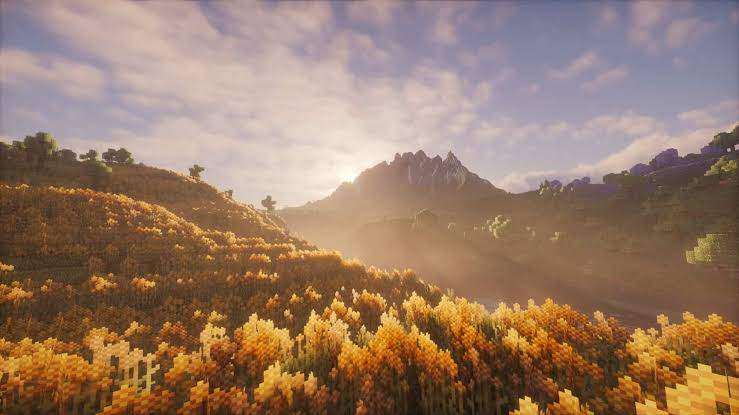
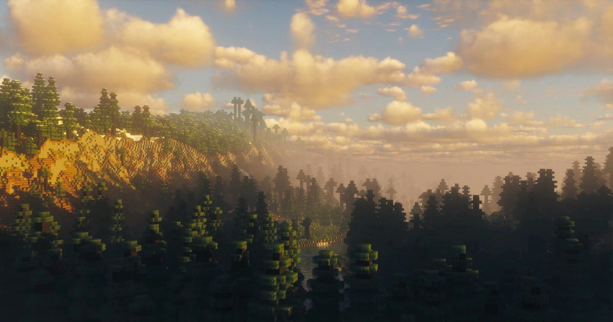
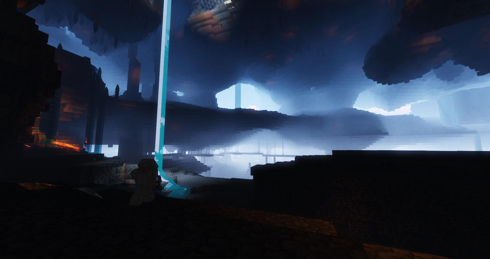
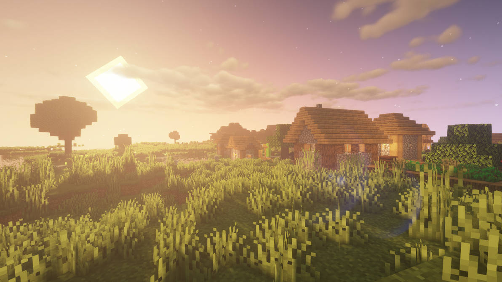

<div align="center">
    


# 🎮 Server Resource Pack

### Official Vanilla+ Resource Pack for Minecraft Fabric 1.20.1

*A carefully curated Vanilla+ resource pack designed to enhance Minecraft with immersive animations, refined textures, and polished visuals while staying true to the original game.*

<p>
    
    
    
    
</p>

<a href="../../releases/latest">
    
</a>

</div>

---
## 📥 Download

### ➜ **[Download the Latest Release](../../releases/latest)**

</div>

---

# 📖 Overview

The **Server Resource Pack** is a carefully curated collection of high-quality community resource packs designed to improve Minecraft's visuals while preserving the original vanilla style.

Instead of completely changing the game's appearance, this pack focuses on polishing the existing experience with smoother animations, richer environments, and subtle visual enhancements—all while maintaining excellent performance.

---

# ✨ Features

- 🎭 Smooth Mob Animations
- 🚶 Player Animation Improvements
- 🌿 Better Leaves
- 🌾 Improved Crops
- 📚 Beautiful Enchanted Books
- 🛏 Better Beds
- 👑 Enhanced Boss Bars
- 🌙 Cubic Sun & Moon
- 💎 Glowing Ores
- 🌑 Default Dark Mode
- ⚡ High Performance
- 🎮 Multiplayer Friendly
- 🚫 No Shaders Required

---

# 📸 Gallery

## 🏡 Spawn

<p align="center">

</p>

---

## 🌲 Forest

<p align="center">

</p>

---

## ⛏ Cave

<p align="center">

</p>

---

## 🏘 Village

<p align="center">

</p>

---

# 📦 Included Resource Packs

| Resource Pack | Included |
|---------------|:--------:|
| Fresh Animations | ✅ |
| Fresh Animations Extensions | ✅ |
| Fresh Moves | ✅ |
| Better Leaves | ✅ |
| Better Beds | ✅ |
| Beautiful Enchanted Books | ✅ |
| Fancy Crops | ✅ |
| Cubic Sun & Moon | ✅ |
| Enhanced Boss Bars | ✅ |
| Default Dark Mode | ✅ |
| Glowing Ores | ✅ |
| Armory Conglomery | ✅ |
| Chat Reporting Helper | ✅ |

---

# 🔧 Requirements

| Component | Version |
|-----------|---------|
| Minecraft | 1.20.1 |
| Loader | Fabric |
| Fabric API | Required |
| Entity Model Features (EMF) | Required |
| Entity Texture Features (ETF) | Required *(if applicable)* |

---

# 🚀 Installation

## Automatic *(Recommended)*

Simply join the server.

Minecraft will automatically prompt you to download the latest version of the resource pack.

---

## Manual Installation

1. Download the latest release.
2. Place the ZIP inside:

```text
.minecraft/resourcepacks
```

3. Launch Minecraft.
4. Go to:

```
Options
   ↓
Resource Packs
   ↓
Enable "Server Resource Pack"
```

---

# 🎯 Design Philosophy

Our goal is to enhance Minecraft **without changing what makes it feel like Minecraft.**

This resource pack is built around five principles:

- Preserve the vanilla art style
- Improve immersion
- Maintain high FPS
- Enhance multiplayer gameplay
- Keep installation simple

---

# 🔄 Updating

The latest version is always available through the **GitHub Releases** page.

Players joining the server will automatically receive updates whenever the server resource pack is updated.

---

# ❤️ Credits

This project combines multiple community-created resource packs.

All textures, models, animations, sounds, and visual assets remain the property of their respective creators.

Please support the original authors by downloading from their official pages whenever possible.

---

# 📜 License

This repository is licensed under the **MIT License** for repository content created specifically for this project.

Individual resource packs remain subject to their original licenses and permissions.

---

<div align="center">

## ⭐ Like the project?

If you enjoy this resource pack, consider leaving a ⭐ on the repository.

Made with ❤️ for the Minecraft Community.

</div>
